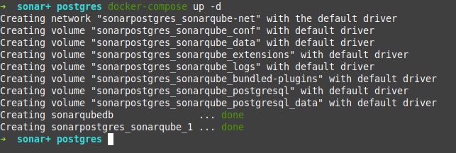

# sonar-docker-compose-POC-ESP

En este documento vamos a detallar como montar a nivel local via docker-compose un artefacto de SONAR para así poder validar nuestros microservicios de spring boot en dicho sonar.

## Creación del fichero docker-compose.yml

En primer lugar, como requisíto indispensable, tendremos que tener instalado docker-compose en nuestra máquina local. 

Crearemos un archivo docker-compose que tendrá que ser como el que se muestra a continuación:

<pre><code>
docker-compose.yml
version: "3"
 
services:
 
  sonarqube:
    image: sonarqube:9.9.0-community
    ports:
        # Si quisiéramos cambiar el puerto en el que se va a levantar sonar bastaría con, por ejemplo, poner "9001:9000"
      - "9000:9000"
    environment:
        # Si cambiamos el puerto del artefacto de postgres, también deberíamos indicarlo en la variable abajo de este comentario
      - SONARQUBE_JDBC_URL=jdbc:postgresql://sonarqubedb:5440/sonar
      - SONARQUBE_JDBC_USERNAME=sonar
      - SONARQUBE_JDBC_PASSWORD=sonar
    networks:
      - sonarqube-net
    volumes:
      - sonarqube_conf:/opt/sonarqube/conf
      - sonarqube_data:/opt/sonarqube/data
      - sonarqube_extensions:/opt/sonarqube/extensions
      - sonarqube_logs:/opt/sonarqube/logs
      - sonarqube_bundled-plugins:/opt/sonarqube/lib/bundled-plugins
 
  sonarqubedb:
    image: postgres
    container_name: sonarqubedb
    networks:
      - sonarqube-net
    environment:
      - POSTGRES_USER=sonar
      - POSTGRES_PASSWORD=sonar
    ports:
           # Si quisiéramos cambiar el puerto en el que se va a levantar POSTGRES bastaría con, por ejemplo, poner "5432:5432"
      - '5440:5432'
    volumes:
      - sonarqube_postgresql:/var/lib/postgresql
      - sonarqube_postgresql_data:/var/lib/postgresql/data
 
networks: 
  sonarqube-net:
 
volumes: 
  sonarqube_conf:
  sonarqube_data:
  sonarqube_extensions:
  sonarqube_logs:
  sonarqube_bundled-plugins:
  sonarqube_postgresql:
  sonarqube_postgresql_data:
</pre></code>

Como podemos observar en el fichero anteriormente mostrado, además del propio artefacto de sonar, se tendrá que crear paralelamente un artefacto de postgres asociado al propio sonar, el cuál será el encargado de alojar los datos de nuestros análisis.

En mi caso en concreto, dicho artefacto de postgres lo estoy dando de alta por el puerto local 5440 ya que el puerto por defecto 5432 lo tengo ocupado por otra instacia de postgres. En el caso que se necesite cambiar a otro puerto, se podría sin problema siempre y cuando se cambie también el puerto en el campo SONARQUBE_JDBC_URL del artefacto de sonar. 

##Lanzando docker-compose.yml

Una vez ya hayamos creado el archivo docker-compose.yml tal y como se ha detallado en el paso anterior, pasaríamos a lanzarlo. Para ello, en una terminal de comandos de nuestro sistema operativo, no situamos en la carpeta donde hayamos creado nuestro archivo y lanzamos el comando "docker-compose up -d". El parámetro -d es para que ejecute nuestro archivo docker compose en background.

Para comprobar si se ha creado correctamente, ejecutamos el comando "docker ps", el cuál sirve para ver los contenedores de docker que hay actualmente en funcionamiento. El resultado de este comando, si todo ha ido bien debería ser similar a lo siguiente:

Llegados a este punto, ya tenemos nuestro contenedor de sonar preparado. Ahora faltaría configurar el acceso y los proyectos, cosa que detallaremos en los siguientes puntos.

## Accediendo y configurando SONAR
### Acceso a SONAR en local
Llegados a este punto, tal y como se ha comentado en el apartado anterior, ya deberíamos tener preparado nuestro contenedor de sonar para poder acceder a él. Para ello, abrimos una ventana/pestaña en nuestro navegador e ingresamos la siguiente url: http://localhost:9000/ (Como se comentó en el punto de la definición del archivo docker-compose, si se ha modificado el puerto de acceso a sonar, obviamente también debe indicarse dicho puerto en la URL).

La primera vez que hagamos login, tendremos que acceder con el usuario "admin" y contraseña "admin" ya que es la que por defecto asigna sonar. 

Al hacer login, la primera vez nos solicitará que modifiquemos la constraseña de dicho usuario. Aquí, elegimos la contraseña que prefiramos para dicho usuario.

### Configurando proyectos en Sonar

Ya habiendo logado, tendremos que seguir los pasos que se van a detallar a continuación:

- Creación del proyecto que se va a auditar. En la pantalla de acceso que nos aparece, tendremos que pulsar en "Manually".
  
  
- Ya en el apartado "manually", en mi caso, voy a dar de alta un proyecto de ejemplo el cuál se llama "poc-jpa-relational-model". Hacemos lo que se muestra en la siguiente captura:
  
  
- Como en principio, para lo que vamos a usar esta instancia de Sonar va a ser a nivel local, en la siguiente pantalla clicaremos en la opción "Locally" para así poder lanzarlo vía maven desde nuestro entorno local. También se podría configurar de diferente manera para que enlazara con el repositorio, pero en este documento no entraremos a detallar esa parte.
  
  
- TODO: añadir todo lo que falta
